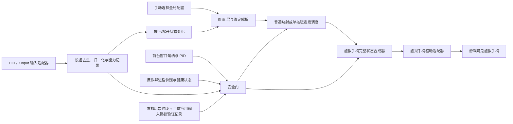

# Windows 手柄映射与单键连发软件：整体架构

> 设计稿与首个开发原型，2026-09-23。目标平台 Windows 10/11、[`.NET 10` LTS](https://learn.microsoft.com/en-us/dotnet/core/releases-and-support)、WPF。**当前配置全局生效，由用户手动切换；不按游戏或应用路径匹配。**`ControllerMapper.Desktop` 已通过 Release 编译并发布为自包含 Windows EXE，且已完成无手柄启动检查。DualSense Edge 的 USB、左右独立背键、按键映射和单键连发均已通过实机验证；蓝牙连接不作保证。Xbox、标准 DualSense 和具体游戏输入路径尚未验收。本文中的分层项目结构与部分接口是后续目标，不能视为现有代码均已实现。项目和发行物采用 Apache-2.0，官方免费发布，与 Sony、Microsoft 均无关联或背书。用途限单机游戏、模拟器和生产力，不用于竞技网游。

## 1. 首版决策与交付边界

**产品决策：输入和映射输出都只使用手柄，不提供键盘/鼠标目标。** P0 输出目标先定为一个系统可见的**虚拟 Xbox 360 兼容手柄**；DualSense/Edge 是物理输入设备，不能据此称虚拟输出具有原生 DualSense/Edge 全部特性。允许用户自行显式安装所需虚拟设备驱动；本软件不捆绑、不静默安装。驱动未就绪时可查看设备与编辑配置，但映射和连发不可用。单键连发仅重复一个虚拟手柄控制项的按下/松开状态；扳机目标以全幅按下/归零脉冲表示；普通映射可输出同时按下的手柄按钮组合，并可由 Shift 层改变映射，组合映射不进入连发调度器。首版没有通用宏引擎和 Lua 入口，MoonSharp 对固定单按钮重复没有实际价值。

这个要求使虚拟手柄输出成为 **P0 前置条件**，不再是 P2 可选项。`SendInput` 只能写入键鼠流，不能承担手柄输出；XInput 的 `SetState` 设置的是震动，GameInput 的设备输出报告也不能给游戏伪造按钮。[SendInput](https://learn.microsoft.com/en-us/windows/win32/api/winuser/nf-winuser-sendinput) · [XInputSetState](https://learn.microsoft.com/en-us/windows/win32/api/xinput/nf-xinput-xinputsetstate) · [GameInput 原始设备输出](https://learn.microsoft.com/en-us/gaming/gdk/docs/reference/input/gameinput/interfaces/igameinputdevice/methods/igameinputdevice_sendrawdeviceoutput?view=gdk-2604) 系统可见的可控虚拟手柄需要经验证的虚拟设备驱动路径；若最终不允许用户安装驱动，则手柄按钮重映射与连发不能作为已交付功能。[微软 VHF 驱动说明](https://learn.microsoft.com/en-us/windows-hardware/drivers/hid/virtual-hid-framework--vhf-)

DualSense Edge 的左右实体背键已在 USB 连接下通过实机验证，可作为独立输入用于按键映射和单键连发；蓝牙连接不作保证。背键设置不会写入手柄固件。[Sony 设备说明](https://www.playstation.com/en-ca/support/hardware/dualsense-edge-other-devices/)

反作弊进程检测虽然列在功能计划的 P1，但“检测到时立即停止连发”的安全规则是运行前提。因此，**最小进程监测与失败关闭门控必须随首版连发一起交付**；P1 可扩展规则库和提示体验。在这项前提未完成前，连发功能不得进入发行构建。

## 2. 解决方案结构与依赖方向

当前可编译原型为 `ControllerMapper.sln` 下的单一 `src/ControllerMapper.Desktop` 项目，内部按 `Core/`、`Input/`、`Output/`、`ViewModels/`、`UI/` 分目录。下图是计划中的多项目拆分；尚未建成的项目和测试目录只是演进目标。

`ControllerMapper` 仅是下列代码示例使用的中性工作命名；最终名称、图标和发行说明须避免官方关联暗示。

```text
ControllerMapper.sln
├─ Directory.Packages.props                 # 集中声明已审查的直接 NuGet 版本
├─ src/
│  ├─ ControllerMapper.Domain/              # 值对象、配置模型、能力与速率规则；无 UI/Win32 依赖
│  ├─ ControllerMapper.Application/         # 端口、全局配置选择、映射解析、安全门、调度与输出仲裁
│  ├─ ControllerMapper.Infrastructure.Windows/ # HID/XInput 候选适配器、前台与进程监测
│  ├─ ControllerMapper.Infrastructure.GamepadOutput/ # 经验证的虚拟手柄后端适配器
│  ├─ ControllerMapper.Infrastructure.Storage/ # JSON 校验、导入导出、原子保存、日志配置
│  └─ ControllerMapper.Desktop/             # WPF + WPF-UI、MVVM、DI 组合根、状态展示
├─ tests/
│  ├─ ControllerMapper.Domain.Tests/
│  ├─ ControllerMapper.Application.Tests/
│  └─ ControllerMapper.Windows.IntegrationTests/ # 需人工启动/实机的可选验证
├─ docs/
│  ├─ ARCHITECTURE.md
│  ├─ DEVICE_CAPABILITIES.md                # 后续填充设备/固件/USB/蓝牙验收矩阵
│  └─ THIRD_PARTY_NOTICES.md                # 发布时由已锁定依赖清单生成并人工核对
└─ installer/                               # Inno Setup 或 WiX；不捆绑/静默安装第三方驱动
```

各项目启用 `RestorePackagesWithLockFile` 并提交对应的 `packages.lock.json`；CI 使用 `dotnet restore --locked-mode`，避免传递依赖无意漂移。[NuGet 锁文件说明](https://learn.microsoft.com/en-us/nuget/consume-packages/package-references-in-project-files)

项目引用方向为 `Infrastructure.* → Application → Domain`，以及 `Desktop → Application + Infrastructure.*`。`Desktop` 的组合根在启动时创建 Windows、存储和虚拟手柄适配器并注入 `Application` 端口；普通 ViewModel 只调用用例，不调用这些适配器。`Domain` 和 `Application` 不引用 WPF、HidSharp、GameInput 或具体虚拟驱动 SDK。运行时日志接口也从 `Application` 注入，Serilog 实现留在外层。测试使用内存输入流、假前台监测和记录型虚拟手柄端口，不需要真实手柄。

| 模块 | 责任 | 明确不承担 |
| --- | --- | --- |
| Domain | 手柄按钮/轴标识、连接与能力状态、绑定、Shift 层、配置版本、单按钮连发参数合法性 | 设备读写、定时器、UI |
| Application | 输入状态变化、按应用选配置、绑定解析、门控、单按钮调度、虚拟手柄状态合成与归零 | Win32 细节、设备协议猜测 |
| Infrastructure.Windows | HID/XInput 输入、前台进程识别、反作弊名称扫描 | 游戏进程注入、内存读取、原始输入屏蔽 |
| Infrastructure.GamepadOutput | 虚拟设备运行时探测、创建、完整状态提交与中性状态提交 | 安装驱动、把 HID 输出报告误作游戏按钮输入 |
| Infrastructure.Storage | `System.Text.Json` 严格读取、导入校验、版本迁移、原子写入、最小化日志 | 执行导入数据中的脚本 |
| Desktop | 三栏 Fluent UI、设备能力/安全状态显示、显式保存/导入/导出、手动恢复 | 业务规则与直接 P/Invoke |

WPF 主窗体按既定 token 实现暗色三栏：左设备和配置、中手柄状态、右属性与连发设置；顶部配置与文件操作，底部连接、电量（仅在可读时）、当前配置与安全状态。控件优先使用 WPF-UI。能力未知时显示“未验证/不可用”，不显示虚构的电量或背键独立识别标记。虚拟设备驱动缺失或物理/虚拟双输入未经目标应用验证时，连发状态必须显示不可用或“可能被物理输入干扰”，不能显示为已受控的单按钮连发。映射选择器只展示手柄按钮、扳机和摇杆，不出现键盘/鼠标目标。

固定视觉 token：背景 `#0F1115`、表面 `#171A21`、卡片 `#1E222B`、边框 `#2A2F3A`、主文本 `#F2F4F8`、次文本 `#A7B0C0`、强调色 `#3B82F6`；圆角 4/8/12、间距 4/8/12/16/24/32、Segoe UI Variable 或 Inter、150–250 ms ease-out。连发设置采用间隔控件和清晰的运行状态，不提供节点图编辑器。

## 3. 输入到输出的数据流



1. **设备接入。** Xbox 物理设备以系统 XInput 1.4 为候选输入路径；DualSense/Edge 以 HidSharp 读取 HID 报告作为候选实现。一个物理设备只选一个活动适配器，避免 HID 与 XInput 双重触发；无法可靠关联跨 API 设备标识时，让用户显式选择输入路径并关闭另一条。适配器输出**会话内来源 ID**、单调时间戳、输入快照、连接方式和来源能力；可选持久物理 ID 只有经该输入路径验证后才保存到配置。XInput 的 0–3 槽位不能当作跨断开或重启的持久设备 ID，槽位重分配须关闭门并重新确认设备。**虚拟 Xbox 设备也会占用 XInput 槽位**：输入适配器必须排除本软件创建的虚拟设备，不能把其报告回送为物理输入；若无法可靠区分，或四个槽位已满而虚拟设备无法创建，则关闭输出门。读错、断开或快照过期变成“不健康”，不得沿用最后一次“按下”状态。XInput 1.4 随 Windows 10/11 提供；标准 `XINPUT_GAMEPAD` 没有独立背键字段。[XInput 版本](https://learn.microsoft.com/en-us/windows/win32/xinput/xinput-versions) · [XInput 多控制器说明](https://learn.microsoft.com/en-us/windows/win32/xinput/getting-started-with-xinput) · [按钮结构](https://learn.microsoft.com/en-us/windows/win32/api/xinput/ns-xinput-xinput_gamepad)
2. **设备能力判定。** 能力表为每台设备和连接方式记录 `IndependentPhysicalInput`、`MappedLogicalOnly`、`Unavailable` 或 `Unknown`，并保留验证依据。DualSense Edge 的 Windows USB 连接及左右独立背键按键映射、单键连发均已通过本项目实机验证；蓝牙连接不作保证。Linux HID 代码仍只是协议参考，不能替代其他设备或固件组合的验收。[Linux 代码](https://github.com/torvalds/linux/blob/master/drivers/hid/hid-playstation.c) · [实测补丁](https://www.spinics.net/lists/kernel/msg6141544.html)
3. **全局配置与前台切换。** 用户手动选择一份全局配置；软件不读取或匹配游戏 `.exe` 路径。周期读取 `GetForegroundWindow` → `GetWindowThreadProcessId` 以确认有可识别的前台窗口。窗口不可识别时输出中性状态；前台窗口句柄变化时立即归零一次，连发须观察到新的松开再按下沿才继续。普通映射在新窗口的后续输入快照中恢复。程序不启动游戏或应用。[前台窗口](https://learn.microsoft.com/en-us/windows/win32/api/winuser/nf-winuser-getforegroundwindow) · [窗口 PID](https://learn.microsoft.com/en-us/windows/win32/api/winuser/nf-winuser-getwindowthreadprocessid)
4. **绑定解析。** 对按钮状态变化、来源 ID、活动配置和 Shift 层生成普通手柄按钮、按钮组合或轴映射，或生成唯一的 `TurboBinding`。每份配置最多一个连发绑定，全程序最多一个运行中的连发任务；目标只能是一个**手柄按钮或全幅扳机**，不得是组合键、摇杆或可编程扳机力度曲线。连发触发源由调度器消费，不进入虚拟手柄的普通透传基线；特别是 Edge 仅报告映射后逻辑按钮且连发目标与该按钮同名时，否则虚拟按钮会一直按下。连发目标也不得与同一配置内其他普通映射的输出按钮重叠。不接受序列、条件树、多键连发、自动压枪参数或无人按住的循环。配置 JSON 带 `schemaVersion`；导入时校验文件大小和深度、字段类型、允许的虚拟设备按钮、唯一绑定、目标冲突和速率范围，拒绝键鼠目标、未知宏动作和脚本字段，再原子替换当前配置。P2 社区分享复用同一校验入口。
5. **门控和调度。** 启动、每次输出前以及设备/前台/进程监测/虚拟设备状态变化时检查安全门。按住触发的上升沿可启动一个调度任务；建议间隔允许 **50–1000 ms**、默认 **120 ms**，每次按下脉冲建议 **20 ms**，且按下时间必须小于间隔。这些是待实机验证的产品参数。调度器只切换一个虚拟按钮位或一根扳机轴的全幅/零值，其他普通映射产生的按钮和轴状态保持不变。松开、门关闭、任务异常立即取消任务并提交该按钮松开；门恢复后仍要求**新的松开再按下**，防止持续按住时自动重启。
6. **虚拟手柄输出。** 输出合成器维护一份完整 `VirtualGamepadState`：先透传规范化的物理手柄按钮和轴状态，**排除所有被绑定消费的源控制项**，再按当前层加入普通映射结果；连发调度只切换独占目标按钮位或扳机轴全幅脉冲。每次变更向经验证的虚拟设备后端提交**完整状态**，避免把手柄状态误建模为 `SendInput` 式独立按键事件。发生停机条件时，先原子关闭门并递增 generation，取消调度、阻止新的普通状态提交，再在同一串行队列提交全中性的按钮/摇杆/扳机状态，随后按后端能力断开虚拟设备；提交失败则显示“虚拟手柄状态未知”并保持门关闭。驱动断开、驱动崩溃或游戏缓存状态时，软件不能保证系统层绝对收到归零。若游戏也读取物理手柄，物理状态仍可能绕过本合成器；必须逐应用验证输入路径。

前台与反作弊状态采用短周期轮询并在每次提交虚拟状态前重新检查；不使用 API hook。停机动作在**发现事件时**立即执行，但 Windows 调度、轮询和设备报告可能带来检测延迟，不能承诺零毫秒停机。虚拟手柄是系统可见设备，不按 HWND 定向；安全门只管本软件的虚拟状态，不能阻止游戏另行读取物理手柄。

## 4. 关键 C# 接口与状态约束（设计伪代码）

```csharp
namespace ControllerMapper.Application;

public enum CapabilityState { IndependentPhysicalInput, MappedLogicalOnly, Unavailable, Unknown }
public enum MonitorState { Clear, KnownAntiCheatPresent, Unknown }
public enum GamepadButton { South, East, West, North, LeftShoulder, RightShoulder, LeftStick, RightStick, Start, Back, DPadUp, DPadDown, DPadLeft, DPadRight }

public sealed record DeviceCapability(
    string SourceInstanceId, string ConnectionKind,
    CapabilityState EdgePaddles, string Evidence);

public sealed record ControllerFrame(
    string SourceInstanceId, long MonotonicTimestamp,
    IReadOnlySet<string> PressedControls,
    GamepadAxes Axes,
    bool IsConnected, bool IsHealthy);

public sealed record ForegroundWindow(nint WindowHandle, int ProcessId);
public sealed record GamepadAxes(float LeftX, float LeftY, float RightX, float RightY, float LeftTrigger, float RightTrigger);
public sealed record VirtualGamepadState(IReadOnlySet<GamepadButton> Buttons, GamepadAxes Axes);
public sealed record TurboSpec(GamepadButton Target, TimeSpan Interval, TimeSpan DownTime);
public sealed record ActiveProfile(string Id, IReadOnlyList<Binding> Bindings);
public sealed record MonitorSnapshot(MonitorState State, DateTimeOffset CheckedAt, string? MatchName);
public sealed record OutputResult(bool Accepted, string? Error);

public interface IControllerInputSource
{
    IAsyncEnumerable<ControllerFrame> ReadFramesAsync(CancellationToken stop);
    DeviceCapability DescribeCapability(string sourceInstanceId);
}

public interface IForegroundAppSource
{
    // null 表示未知；调用方必须关闭输出门。
    ForegroundWindow? ReadCurrent();
}

public interface IProfileRepository
{
    ActiveProfile? GetManuallySelected();
    Task<ProfileImportResult> ValidateAndImportAsync(Stream json, CancellationToken stop);
    Task ExportAsync(string profileId, Stream destination, CancellationToken stop);
}

public interface IAntiCheatMonitor
{
    // 扫描失败或结果过期必须返回 Unknown，不能默认为 Clear。
    MonitorSnapshot ReadLatest();
}

public interface ISafetyGate
{
    GateSnapshot Read();
    bool IsCurrent(long generation); // 状态改变时 generation 递增
    void CloseAndRequireFreshPress(string reason);
    void AcknowledgeManualResume(); // 仅在监测恢复 Clear、配置/设备健康后生效
}

public interface ITurboScheduler
{
    // 只切换一个手柄按钮或全幅扳机；任务生命期同时受 holdStop 和门的 generation 约束。
    Task RunWhileHeldAsync(TurboSpec spec, long gateGeneration, CancellationToken holdStop);
    void StopNow(string reason);
}

public interface IVirtualGamepadSink
{
    GamepadOutputHealth Probe(); // 含虚拟设备身份；缺失/不兼容/无法与物理输入区分均不可当作 Healthy
    OutputResult Connect();
    OutputResult Submit(VirtualGamepadState fullState);
    OutputResult Neutralize(); // 提交所有按钮松开、轴回中、扳机归零
    void Disconnect();
}

public interface IGamepadStateComposer
{
    void ApplyNormalMappings(ControllerFrame frame, ActiveProfile profile);
    void SetTurboButton(GamepadButton button, bool pressed);
    OutputResult Flush();      // 串行提交完整状态
    OutputResult Neutralize(); // 故障路径也要尝试，不受普通取消令牌阻断
}
```

实际实现可用 `PeriodicTimer` 或 `Stopwatch` 加可取消等待；以单调时间计算下一次按下，跳过积压节拍，绝不在暂停后补发。所有状态变更和 `Submit/Neutralize` 在同一输出队列串行化。门的 generation 防止旧任务在焦点切换或配置变更后继续提交。只有观察到新的按下沿、物理设备健康、虚拟后端健康且门开启，才可建立调度任务；第二个触发器不能启动另一任务。普通映射和连发绑定不能同时占用同一源按钮或连发目标；修改绑定、切层或换配置时先提交中性状态再解析新状态。

`Submit` 成功只表示虚拟设备后端接受状态，不证明目标游戏消费了该状态。故障时的 `Neutralize` 是本进程立即执行、检查并上报的最佳努力操作，不应写成对所有驱动与游戏窗口绝对成功。

## 5. 反作弊进程监测与失败处理

监测器只枚举本机进程的 PID 和可获得的**基本进程名**，使用经过审查的 EAC、BattlEye、Vanguard、XignCode 等进程名列表进行大小写不敏感的**完整基本名称**匹配（统一是否包含 `.exe`）。名单需包含出处、更新日期及测试样本；不得以宽泛子串匹配，如 `game` 或 `service`。不读取游戏内存、模块、命令行、窗口内容，也不尝试规避反作弊。进程名检测只能尽力识别，不能覆盖改名、驱动级组件或所有版本；`Clear` 也不是“适用于竞技网游”的证明。[`Process.GetProcesses` 文档](https://learn.microsoft.com/en-us/dotnet/api/system.diagnostics.process.getprocesses?view=net-10.0)

| 情况 | 门控与 UI 处理 |
| --- | --- |
| 命中已知名称 | 立即取消连发，向虚拟手柄提交全中性状态并阻止新的映射输出；显示命中名称和“已暂停”。进程退出后仍需用户手动恢复，并重新按下触发键。 |
| 误报（同名无关程序） | 精确名称匹配减小误报；向用户显示命中名称并支持报告误报。当前会话仍保持关闭，不提供在命中时绕过的开关。维护者复核名单后再更新。 |
| 漏报 | 说明只能识别名单中的可见进程；不宣称反作弊兼容或可规避。用户仍须遵守“单机、模拟器和生产力”用途约束。 |
| 监测异常、启动未有首个成功快照、结果过期 | 状态为 `Unknown`，立即关闭门并释放；显示监测故障。恢复健康后要求手动恢复与新的按下沿，不能自动续跑。 |
| 单个进程在枚举中消失 | 视为进程竞态；不把一个 PID 的读取异常默认为反作弊不存在。若无法判定完整快照是否可信，则标为 `Unknown`。 |

建议每 **500 ms** 扫描一次，并为健康快照设置超时；这是可测的初始值，不是即时检测保证。扫描任务崩溃、延迟超过超时或无法取得所需基本名称时失败关闭。提交虚拟手柄状态前还要读取最新快照；检测到危险状态时由状态合成器统一停止和归零。正常配置切换或设备断开同样关闭并归零，但反作弊退出、监测故障恢复不会自动恢复连发。日志只写状态变化、错误类别和必要的命中名称；不记录连续按键活动、完整窗口标题或用户其他进程清单。

## 6. 四个能力边界与后续功能的影响

| 条件或诉求 | 可实现的内容 | 不可声称的内容 |
| --- | --- | --- |
| **不装任何虚拟设备驱动** | 识别手柄、编辑配置、验证背键可观测性。 | 系统可见的虚拟手柄按钮输出、重映射和连发；即使驱动是 UMDF 用户态驱动，也仍属于必须安装的驱动路径。[微软 UMDF HID 说明](https://learn.microsoft.com/en-us/windows-hardware/drivers/wdf/creating-umdf-hid-minidrivers) |
| **只用 `SendInput`** | 仅能合成键鼠输入；本项目修订后不使用此输出路径。 | 发送 Xbox/DualSense/虚拟手柄按钮事件；`INPUT_HARDWARE` 也不是虚拟手柄 API。[`SendInput`](https://learn.microsoft.com/en-us/windows/win32/api/winuser/nf-winuser-sendinput) · [`INPUT` 结构](https://learn.microsoft.com/en-us/windows/win32/api/winuser/ns-winuser-input) |
| **连发目标是游戏手柄按钮** | 经审查的虚拟手柄驱动已由用户显式安装且可用时，P0 通过反复提交含单个按钮位变化的完整手柄状态实现。 | 无驱动可用时实现 P0；也不能保证游戏只看虚拟手柄。若物理手柄同名按钮仍保持按下，游戏可能看不到虚拟按钮的松开相位。 |
| **屏蔽原始手柄输入** | 用户可在游戏中选择只读虚拟设备，或另行评估由用户安装的设备隐藏/过滤方案。 | 仅靠虚拟输出驱动、XInput 或 GameInput 保证游戏收不到物理输入。即使采用 HidHide，官方也说明它不能屏蔽 Raw Input，且 Xbox/XInput 手柄的隐藏并不可靠，不能承诺所有游戏只看到虚拟设备。[HidHide FAQ](https://docs.nefarius.at/projects/HidHide/FAQ/) |

这组边界也影响 P1：摇杆死区和响应曲线可作用于**本软件提交的虚拟摇杆轴值**；原始摇杆信号若仍被游戏读取则不受影响。陀螺仪只有在设备确实可读且目标虚拟手柄控制项可表达时才开放映射。DualSense 自适应扳机力度调节是向**物理设备**输出效果，与虚拟按钮状态是两条不同路径，需独立核验协议、固件、USB/蓝牙与运行时；Sony 的 Windows 配置工具能设置 Edge 配置，不等于本项目已有写入能力。[Sony PC 配置说明](https://www.playstation.com/en-au/support/hardware/set-up-edge-pc/) 微软的 DualSense 辅助代码可作为候选研究材料，但不能推断所有连接方式可用。[GameInput DualSense companion](https://github.com/microsoftconnect/GameInput/blob/main/companion/DualSense/README.md)

GameInput 可作为后续输入适配器，不在首版默认依赖链中。其新版本公开了更丰富控制项，但目标 Windows 机器上的 GameInput 运行时版本决定接口集合；NuGet 安装不会自动部署最新版运行时。现行 `GetRawReport` 参考页仍写“仅 GIP 设备”，而 3.4+ 官方包更新记录又写“增加 raw HID reports 支持”。两份资料有版本差异，须在锁定版本下核对具体接口并在 Edge 设备上测试；首版不据此承诺可读 Edge 原始报告。[GameInput NuGet/运行时说明](https://learn.microsoft.com/en-us/xbox/gdk/docs/features/common/input/overviews/input-nuget?view=gdk-2604) · [版本规则](https://learn.microsoft.com/en-us/gaming/gdk/docs/features/common/input/overviews/input-versioning) · [`GetRawReport` 参考](https://learn.microsoft.com/en-us/gaming/gdk/docs/reference/input/gameinput/interfaces/igameinputreading/methods/igameinputreading_getrawreport?view=gdk-2604) · [3.4+ 更新记录](https://www.nuget.org/packages/Microsoft.GameInput/3.5.274)

## 7. 推荐依赖、许可证与发行审查

版本为 **2026-09-23 的候选锁定值**，还不是已执行 restore 的依赖树。`net10.0-windows` 的最终解析、包内许可证、原生文件和安装器要在真实发行构建中复核。第三方许可随发行包一同提供；主项目的 Apache-2.0 不会改变第三方许可，也允许下游商业使用。

| 用途 | 直接包或资源 | 候选版本 | 已核对的直接许可证 | 已知直接/传递依赖与额外审查 |
| --- | --- | --- | --- | --- |
| WPF Fluent 控件 | [`WPF-UI`](https://www.nuget.org/packages/WPF-UI/4.3.0) | 4.3.0 | MIT | 依赖 `WPF-UI.Abstractions` ≥4.3.0（候选解析 4.3.0），MIT；内嵌 Fluent System Icons 为 MIT，随包保留 [ThirdPartyNotices](https://github.com/lepoco/wpfui/blob/main/ThirdPartyNotices.txt)。不要另行打包 Segoe Fluent Icons 字体。 |
| MVVM | [`CommunityToolkit.Mvvm`](https://www.nuget.org/packages/CommunityToolkit.Mvvm/8.4.2) | 8.4.2 | MIT | 当前适用资产未列额外 NuGet 依赖；生成器为构建期组件，发行时再查实包。 |
| DI | [`Microsoft.Extensions.DependencyInjection`](https://www.nuget.org/packages/Microsoft.Extensions.DependencyInjection/10.0.12) | 10.0.12 | MIT | `Microsoft.Extensions.DependencyInjection.Abstractions` ≥10.0.12，MIT；拟显式固定 10.0.12，并以锁文件验证实际解析。 |
| HID 读取 | [`HidSharp`](https://www.nuget.org/packages/HidSharp/2.6.4/License) | 2.6.4 | Apache-2.0 | NuGet 页面列无依赖；协议解析由本项目维护，需实机验证。 |
| 结构化日志 | [`Serilog`](https://www.nuget.org/packages/Serilog/4.4.0) | 4.4.0 | Apache-2.0 | 适用资产未列 NuGet 依赖；避免记录完整输入流。 |
| 本地日志文件 | [`Serilog.Sinks.File`](https://www.nuget.org/packages/Serilog.Sinks.File/7.0.0) | 7.0.0 | Apache-2.0 | 依赖 `Serilog` ≥4.2.0，由上行锁到 4.4.0。 |
| JSON | [`System.Text.Json`](https://learn.microsoft.com/en-us/dotnet/standard/serialization/system-text-json/overview) | .NET 10 内置 | 随 .NET 发行 | 首版不额外安装 NuGet 包；审查最终选择的 .NET Desktop Runtime 或自包含发布条款。 |
| Xbox 输入 | Windows XInput 1.4 | 系统组件 | 非 NuGet | 通过系统 DLL 调用，不分发旧 XInput 1.3；验证目标 Windows 版本。[微软版本说明](https://learn.microsoft.com/en-us/windows/win32/xinput/xinput-versions) |
| 图标 | [Lucide 选取的静态资源](https://github.com/lucide-icons/lucide/blob/main/LICENSE) | 发布时锁定 commit | ISC；部分源自 Feather 的图标另含 MIT 条款 | 连同完整上游 LICENSE 与所选资源版本发布；不得把图标许可证简单写成单一 MIT。 |

**P0 技术验证先用 ViGEmBus v1.22.0 + `Nefarius.ViGEm.Client` 1.21.256；这不是发行批准。** 其项目已停更，只有安装包许可、签名与安全审查、Windows 10/11 和 .NET 10 实机测试、虚拟/物理双输入验收全部通过，才能成为首版后端；未通过则暂停手柄映射和连发发行，另评估维护中的后端。两条路径的取舍如下：

| 候选路径 | 已知许可与能力 | 发行前阻断项 |
| --- | --- | --- |
| 用户自行安装 [ViGEmBus v1.22.0](https://github.com/nefarius/ViGEmBus/releases/tag/v1.22.0)；应用用 [`Nefarius.ViGEm.Client` 1.21.256](https://www.nuget.org/packages/Nefarius.ViGEm.Client/1.21.256) 接入 | 驱动仓库源码标 BSD-3-Clause，客户端 MIT、NuGet 页面列无依赖；驱动官方仅列虚拟 Xbox 360 和 DualShock 4，**不是虚拟 DualSense**。 | 驱动和客户端已[停止维护](https://docs.nefarius.at/projects/ViGEm/End-of-Life/)；要审查 **v1.22.0 实际安装包**的许可证、签名、Windows 10/11 兼容性与维护风险。该最终版移除了旧自动更新器；不得仅凭 NuGet 计算兼容性认定 .NET 10 实测通过。 |
| [HIDMaestro](https://github.com/hifihedgehog/HIDMaestro) 的 UMDF2 虚拟设备路径 | 仓库标 MIT，声称提供 .NET 10 SDK 与更多手柄形态；虽非内核模式主驱动，仍需 Windows 驱动安装。 | **仅研究，不进入当前发行包**：其 SDK DLL 的[v1.9.0 发行说明](https://github.com/hifihedgehog/HIDMaestro/releases/tag/v1.9.0)列有内嵌驱动、USB/IP 传输和签名工具，与“不捆绑驱动”承诺冲突；[安装说明](https://hidmaestro.org/docs/reference/driver-install-and-signing/)涉及管理员权限及本机证书/签名，较早版本还曾有启动故障。需先解决发行方式、全部内嵌组件许可、安全、签名和实机兼容，不得自动调用安装 API。 |

可选的物理输入隔离不是虚拟输出后端的一部分。[HidHide](https://github.com/nefarius/HidHide) 是 MIT 的独立内核过滤驱动，若将来采用须由用户显式安装并逐应用验证；官方说明其不能屏蔽所有 Raw Input 路径、Xbox/XInput 隐藏并不可靠，也不能仅隐藏一个按钮。[HidHide FAQ](https://docs.nefarius.at/projects/HidHide/FAQ/) 无法证明目标应用只使用虚拟设备时，应禁用需要“真正替换原按键”语义的配置，尤其是原手柄同名按钮保持按下的连发。

**暂不引入：** [`MoonSharp` 2.0.0](https://www.nuget.org/packages/MoonSharp/2.0.0)。若以后仍坚持 Lua，必须只暴露受限的单键重复参数，不能允许运行通用脚本；其许可证为 BSD-3-Clause，不能写作 MIT，还需核对实包中随附资源和署名。[MoonSharp LICENSE](https://github.com/moonsharp-devs/moonsharp/blob/master/LICENSE) 当前需求用强类型 `TurboSpec` 更易校验与停止。

`Microsoft.GameInput` 3.5.274 是后续候选，且是**原生** NuGet 包，不是现成的 C# SDK。其公开头文件/静态库的 MIT 与 `GameInputRedist.msi` 的单独 Microsoft Software License Terms 不能混为一谈；后者有独立分发条件。不得在未完成逐版本条款审查和 C# 互操作设计前随安装器附带 MSI。[NuGet 包](https://www.nuget.org/packages/Microsoft.GameInput/3.5.274) · [再分发说明](https://learn.microsoft.com/en-us/xbox/gdk/docs/features/common/input/overviews/input-nuget?view=gdk-2604) · [GameInput 许可文件](https://github.com/microsoftconnect/GameInput/blob/main/LICENSE)

安装器建议先评估 **Inno Setup**：其[自有许可](https://github.com/jrsoftware/issrc/blob/main/license.txt)允许免费使用并有版权/修改标记等条件，不能误列成 Apache-2.0；官网另[请求商业用户购买许可](https://jrsoftware.org/isorder.php)，构建者需按自身用途评估。若改用 WiX，除其 [MS-RL 源码许可](https://github.com/wixtoolset/wix/blob/main/LICENSE.TXT)外，还须审查官方二进制的 [OSMF EULA](https://github.com/wixtoolset/wix/blob/main/OSMFEULA.txt) 对选定使用方式的要求。无论选择哪种，都要审查 .NET Desktop Runtime 的实际发布方式；自包含运行时资产适用独立的 [.NET Library License 说明](https://github.com/dotnet/core/blob/main/license-information.md)及第三方声明，不能仅凭源码 MIT 判定发行义务。项目安装器不捆绑、不静默安装任何虚拟/过滤驱动，不注册额外服务，不默认开机启动，也不捆绑下载版 Segoe Fluent Icons 字体。[微软字体说明](https://learn.microsoft.com/en-us/windows/apps/design/iconography/segoe-fluent-icons-font)

发行门禁：锁文件与 .NET 10 的 [`dotnet package list --include-transitive`](https://learn.microsoft.com/en-us/dotnet/core/tools/dotnet-package-list) 结果逐项比对，检查包内和原生依赖许可，保存第三方许可文本及 NOTICE，核对运行时再分发文件和发行包实际内容；每次升级版本都重做审查。

## 8. 验收与仍待证明的能力

首版软件验收至少覆盖：按住/松开、焦点变更、物理或虚拟设备断开、输入流超时、配置切换、连发异常、反作弊命中与扫描失败后先关闭门再向虚拟设备提交中性状态；旧任务不能在门重开后补发；组合按钮映射不会进入连发器；**触发源与连发目标为同名逻辑按钮时仍有完整的虚拟按下/松开沿**；虚拟设备不会被重新枚举为本软件的物理输入且 XInput 槽位耗尽时正确关闭门；导入的超范围间隔、键鼠目标、未知动作和 Lua 字段被拒绝。人工 Windows 验收要通过独立的手柄状态观察工具和目标应用确认虚拟 Xbox 兼容设备的按钮上升/下降沿、归零和断开行为，记录驱动版本、连接方式与焦点轮询最坏可观察停机延迟，不把结果概括为“所有游戏可用”。

还必须分别测试“只有虚拟设备被目标应用读取”和“物理加虚拟设备同时被读取”。后者可能把原按钮的持续按下与虚拟连发混合，不能计为单按钮连发验收通过。目标应用到底读取哪只手柄不能由驱动 `Probe()` 自动判断；要保存逐应用人工验收记录，并在游戏版本、控制器设置或连接方式变化后重新验证。用户未安装已批准的虚拟后端、后端不健康、或无法确认目标应用只使用正确输入路径时，UI 不得标示该配置已正常实现重映射/连发。不会自动安装或配置任何驱动。

硬件验收矩阵按**设备型号 × 固件版本 × USB/蓝牙 × 输入路径**记录独立背键、映射后逻辑输入、电量、断开事件、陀螺仪和触发器能力。DualSense Edge 的 USB、左右独立背键映射及连发已通过实机验收；蓝牙连接不作保证，其他没有验收证据的组合显示 `Unknown`，不写入 README 的已支持表。不能把 Linux 协议线索标成 Windows 实测结果。

README、关于页与发行说明必须一致写明：**仅限单机、模拟器和生产力；不用于竞技网游；与 Sony、Microsoft 无关联；仅支持手柄输入和手柄输出。手柄按钮输出取决于经验证的虚拟设备驱动；本软件不捆绑或静默安装驱动，也不保证屏蔽物理手柄输入。**
